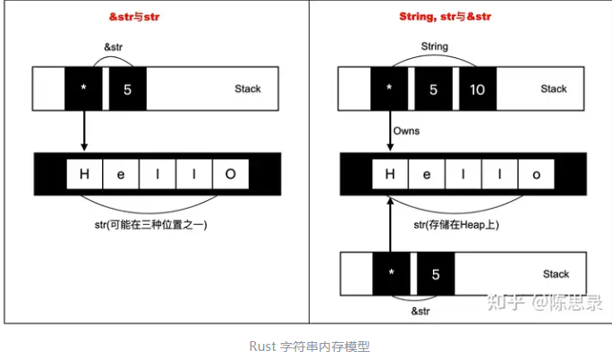
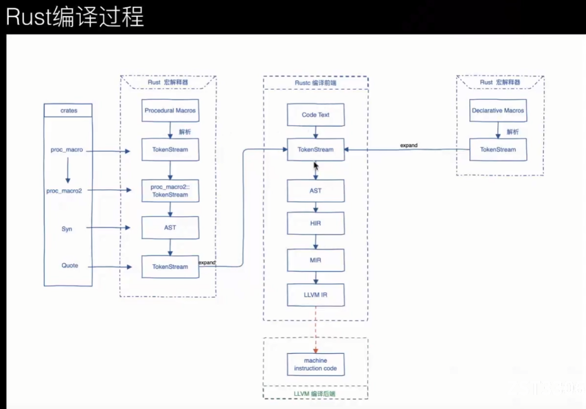

# Rust

>
>`Rust官方API文档：https://doc.rust-lang.org/std/index.html`
>`Rust官方文档：https://doc.rust-lang.org/book/`
>
>`2023年Rust入门教程：P15`

## 基础介绍

编译型、无GC、安全性高的系统编程语言


rust程序：`.rs`文件

rust安装环境变量：`RUSTUP_HOME`、`CARGO_HOME`
rustup镜像环境变量：`RUSTUP_DIST_SERVER`、`RUSTUP_UPDATE_ROOT`
- `RUSTUP_HOME`: Rust编译工具链
- `CARGO_HOME`:  Cargo包管理主目录

要求写分号`;`
变量支持自动类型推断、默认不可变


### rustup
```yaml
rustup:
    check: # 检查工具更新
    component: # 功能组件管理
        add:
            rustfmt:
    doc: # 打开本地文档
    default: # 设置默认工具(rust版本管理)
        nightly:
        stable:
    help:
    run:
    self: # 修改已安装工具
        update:
        uninstall: # 卸载
    show: # 显示已安装的工具
    target:
    toolchain: # 已安装的工具链
        install:
        list:
    update: # 更新rust工具
```

rust工具链安装器


### rustc
```yaml
rustc:
    -o:
    --crate-type:
        lib:
    --version:
```

rust编译器


### cargo
```yaml
cargo:
    -h:
    --help:
    --version:
    add: # 添加第三方包
        --build:
        --dev:
    bench: # 测试
    build: # 打包
        --release: 
    check: # 检查代码
    clean:
    help:
    init: # 初始化
    install: # 打包到本地仓库
    new: # 新建cargo包(项目)
        --lib:
    publish: # 发布包
    remove: # 移除包
    run: # 运行
    test: # 运行测试代码
    uninstall:
    update: # 更新包
```

rust包管理工具

cargo添加的依赖存放在`%CARGO_HOME%/registry`下


#### Cargo.toml
```yaml
build-dependencies:
dependencies: 
dev-dependencies:
package:
    authors:
    edition:
    name:
    version:
```


## 核心内容
```yaml
alloc:
core:
proc_macro:
    token_stream:
    Group: # 代码段
    Ident: # 标识符
    Literal: # 字面量
    Punct: # 标点符号
    TokenStream:
        default():
        from():
        read_to_string():
    TokenTree:
std: # 核心包
    alloc:
    any:
    array:
    boxed:
        Box:
    cell:
    cmp:
        Ordering:
            Equal:
            Great:
            Less:
    collections: # 集合
        HashMap: # 哈希表
            insert():
            new():
        Vec: # 
            new():
    convert:
    default:
    env:
    error:
    fmt:
        format(): # 字符串格式化
    fs:
    future:
    hash:
    io:
        Result:
            expect(): # 打印异常细腻些
            is_ok():
            unwrap(): # 直接取结果
            Err():
            OK():
        Stdin:
            read_line():
        stdin(): # 获取输入流
    iter:
    mem:
        sizeof(): # 内存大小
        size_of_val(): # 变量内存大小
    net:
    ops:
        Range: # 范围
            enumerate(): # 带索引遍历
    option: # 可空
        Option: # 可空枚举
            None:
            Some(T): # 有值
    os:
    path:
    prelude: # 预加载模块
    process:
    result: # 结果
        Result: # 结果枚举
            Err(E):
            Ok(T):
            is_ok():
    slice:
    str: # 不可变字符串、字符串切片
        char_indices():
        chars():
        len():
        split():
        to_string():
        trim():
    string: # 字符串
        String: # 可变字符串(引用类型)
            as_str():
            clone():
            cmp(): # 字符串比较
            from(): # 根据字符串常量创建字符串
            len(): # 字符串长度
            new(): # 新建字符串
            parse(): # 字符串解析
            push(): # 添加字符
            push_str(): # 添加字符串
            trim():
    sync:
    task:
    thread:
    time:
    vec:
        Vec:
            append():
            into_iter():
            iter(): # 迭代器
            iter_mut():
            new():
    format!(): # 字符串格式化(宏)
    panic!(): # 异常抛出(宏)
    print!():
    println!(): # 打印输出(宏)、支持字符串格式化
    vec![]:
test: # 测试库
```


### Data Types
```yaml
DataTypes:
    array: # 数组类型
    bool: # 布尔
    char: # 字符（4字节）
    f32:
    f64: # 浮点数默认
    fn: # 函数
    i32: # 整形默认
    i64:
    isize:
    pointer: # 指针
    reference: # 引用
    slice: # 切片
    str: # 字符串切片
    tuple: # 元组
        .0:
        .1:
        .2:
    u8: # 字节
    u32:
    u64:
    unit: # 空类型
    usize:
```

`let`:
`let mut`:
`const`: 定义常量
`static`: 静态变量

变量默认是不可修改的
可以使用相同的名字声明新的变量，新的变量会shadow之前的同名变量
const声明不允许重复声明


#### Str

&str 是不可变的字符串切片，是对 String 或字面量字符串的引用

值类型

字符串切片的不可变引用`&str`：指向字符串一部分内容的引用
字符串字面值也是字符串切片


#### String
```rust
```

可变字符串

引用类型Move

String 是可变的、拥有所有权的字符串类型，通常用于动态构建和修改字符串

String是str的指针，并拥有str的所有权，可以通过它修改str的值
`str`等效于`[u8]`
String与&str都是指向str的指针，String包含：指针、长度、容量，而&str只包含：指针、长度




#### Array


固定长度数组
[type; size]


值类型Copy  


#### Tuple

元组


值类型Copy


#### Range

范围


#### Slice


`[start..end]`: 左闭右开


数组切片
切片 (slice) 是对数组或 Vec 的一部分的引用，用于避免复制数据，提高性能
切片不持有所有权


#### Vec

动态数组

引用类型Move


#### HashMap


哈希表

引用类型Move


#### Enum
```rust
enum Color {
    RED(type),
    BLUE(type)
}

Color::RED
```

枚举

利于match解构和if let解构
枚举也可定义方法impl


### Control Flow
```yaml
ControlFlow:
    as: # 强制类型转换
    const: # 常量定义
    let: # 变量定义
    mut: # 可变定义
    static: # 静态变量
    for ... in ...:
    if ... else if ... else ...:
    loop ...:
    match ...:
    unsafe ...: 
    while ...:
        break:
        continue:
```

Result解决了一部分异常处理的逻辑


#### match
```rust

```

模式匹配

match通常和枚举一块使用


#### exception


### Function


`fn`定义函数

Statement语句最后一行的值默认为返回值


#### async

异步函数


### Struct
```rust
pub struct User {
    id: u32,
    name: String
}

impl User {
    fn print(&self) {
        "实例方法定义"
    }

    fn new(id: u32, name: &str) {
        "静态方法定义"
    }
}
```

结构体

引用类型Move

struct赋值默认也是会发生移动Move的
struct方法定义写在外面impl

支持解构


#### Tuple Struct
```rust
struct Color(i32, i32, i32);
```

元组结构体


#### trait

特质、类似其它语言的接口


### Ownership


内存所有权，内存通过一个所有权系统来管理

栈内存、堆内存，使用所有权来管理heap上的数据

Copy trait、Drop trait

变量走出作用域时，会调用drop函数

引用`Reference`&；引用传递不会丢失所有权，把引用作为函数参数的行为就叫做借用`Borrow`

`&mut`在特定作用域内，对某一块数据只能有一个可变引用；不可以同时拥有一个可变引用和一个不可变引用

`Danling Reference`悬空引用：编译器保证引用永远都不是悬空的


#### Move

移动：引用型变量赋值后会丢失所有权（默认发生移动）

栈上的数据不存在移动

函数返回堆上数据也会发生所有权一定给你


#### Lifetime

- &`static

变量生命周期，生命周期的主要作用是**避免悬垂引用**

生命周期标注通常是用在引用类型上的``&`a mut i32``


实际生命周期要大于等于声明的生命周期

在函数返回值有多个不同生命周期的的时候，要求返回类型是所有返回值中生命周期最小的那个

- 每一个引用参数都会获得独自的生命周期
- 若只有一个输入生命周期(函数参数中只有一个引用类型)，那么该生命周期会被赋给所有的输出生命周期，也就是所有返回值的生命周期都等于该输入生命周期

struct自己的生命周期可以比属性引用的生命周期短


### Smart Pointer


### Generic


### Module
```rust
mod mod_name {

}
```

Package->Crate->Module


模块默认是私有的，公共需标明`pub`

`use`使用模块中的东西，使用`as`定义别名


Crate类型：
- binary
- library


路径Path：绝对路径、相对路径（super、self）

默认隐式为根crate


### Attribute
```yaml
Attribute:
    allow:
        non_camel_case_types:
    cfg:
        条件编译
    cold:
    derive: 自动实现trait(可用于struct或枚举)
        Debug:
        Clone:
        Copy:
    feature:
        box_syntax:
    link:
        kind:
        name:
    macro_use:
    main: 主函数
    plugin_registrar:
    proc_macro: 定义宏函数
    proc_macro_attribute:
    should_panic:
    start:
    test:
```


Meta元数据表述：`#[name(arg1, arg2 = "param")]`


### Macro
```yaml
声明宏:
    assert_eq:
    include_str:
    panic:
    println:
    todo:
    vec:

过程宏:
    proc_macro_atttribute: 属性宏
```



Rust宏：声明宏、过程宏

自定义宏：`proc_macro`；tokenstream->string->tokenstream生成代码（元编程）

过程宏必须定义在一个单独的crate中

过程宏开发依赖包：
- proc-macro2：
- syn：
- quote：动态拼接字符串


### Test


### Concurrency


### Unsafe


